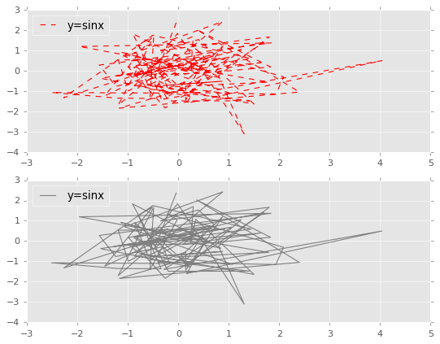

```python
# pyhton绘图示例


import numpy as np
import matplotlib.pyplot as plt
import pandas as pd
import random
# 魔法函数，用于内嵌图像，属于IPython、Jupyter Notebook内嵌的，Pychram没有，可省略plt.show()这一步
%matplotlib inline
```


```python
# x = np.random.rand(4,5)
x = np.linspace(0, 20, 30)
x
```


    array([ 0.        ,  0.68965517,  1.37931034,  2.06896552,  2.75862069,
            3.44827586,  4.13793103,  4.82758621,  5.51724138,  6.20689655,
            6.89655172,  7.5862069 ,  8.27586207,  8.96551724,  9.65517241,
           10.34482759, 11.03448276, 11.72413793, 12.4137931 , 13.10344828,
           13.79310345, 14.48275862, 15.17241379, 15.86206897, 16.55172414,
           17.24137931, 17.93103448, 18.62068966, 19.31034483, 20.        ])


```python
y = np.sin(x)
fig = plt.figure()
plt.plot(x, y, "o", label = "y=sinx")
# plt.legend图例
plt.legend()
```


    <matplotlib.legend.Legend at 0x1ecba821588>


```python
plt.plot(x, y, "--",label = "y=sinx")
plt.legend(loc=2)
plt.legend?
```


```python
plt.plot(x, y, "d", label = "y=sinx")
plt.legend(loc = 0)
```


    <matplotlib.legend.Legend at 0x1ecbc1a7a20>


```python
plt.plot(x, y, "p", label = "y=sinx")
plt.legend(loc = 1)
```


    <matplotlib.legend.Legend at 0x1ecbc2d2a90>


```python
# 保存图片
fig.savefig("E:/testpic.png")
```


```python
#可用于查看函数时间复杂度，由此可见numpy模块的数学函数效率要高些
%timeit np.sum(x)
%timeit sum(x)
```

    2.49 µs ± 16.9 ns per loop (mean ± std. dev. of 7 runs, 100000 loops each)
    4.58 µs ± 121 ns per loop (mean ± std. dev. of 7 runs, 100000 loops each)
    


```python
%timeit np.random.random()
%timeit random.random()
```

    351 ns ± 10.5 ns per loop (mean ± std. dev. of 7 runs, 1000000 loops each)
    71.9 ns ± 1.13 ns per loop (mean ± std. dev. of 7 runs, 10000000 loops each)
    


```python

plt.plot(x, y, "--",label = "y=sinx")
plt.legend(loc=2)
```


    <matplotlib.legend.Legend at 0x1ecba995320>


```python
plt.subplot(2,1,1)
plt.plot(x, y, "--",label = "y=sinx", color="red")
plt.legend(loc=2)
plt.subplot(2,1,2)
plt.plot(x, y, "-",label = "y=sinx", color="grey")
plt.legend(loc=2)
```


    <matplotlib.legend.Legend at 0x1ecc34f9470>





```python
# plt.subplot函数，把画布拆分成m行，n列,第i个
m,n=3,1
i = 1


plt.subplot(m, n,i)
plt.plot(x, y, "--",label = "y=sinx", color="black")
plt.legend(loc="best")


plt.subplot(3,1,2)
plt.plot(x, y, "-",label = "y=sinx")
plt.legend(loc=1)


plt.subplot(3,1,3)
plt.plot(x, y, "o",label = "y=sinx", color="orange")
plt.legend(loc="upper right")

```


    <matplotlib.legend.Legend at 0x1ecc33dca58>


```python
plt.plot(x, y, "o",label = "y=sinx", color="orange", markersize=16)
```


    [<matplotlib.lines.Line2D at 0x1ecbe4d9198>]


```python
# markersize(如果不为线性标记)标记的大小，linewidth(如果是线或虚线的话)线宽，markeredgecolor(如果不为线性标记)标记的外框线的颜色，
# markeredgewidth(如果不为线性标记)标记的外框线的宽度(粗度)
plt.plot(x, y, "p",label = "y=sinx", color="orange", markersize=16,linewidth=5, markeredgecolor="red", markeredgewidth=6)
```


    [<matplotlib.lines.Line2D at 0x1ecbf964be0>]


```python
plt.plot(x, y, "p",label = "y=sinx", color="orange", markersize=16,linewidth=5, markeredgecolor="red", markeredgewidth=2)
plt.ylim(-0.5,0.5)
```


    (-0.5, 0.5)


```python
plt.plot(x, y, "p",label = "y=sinx", color="orange", markersize=16,linewidth=5, markeredgecolor="red", markeredgewidth=2)

plt.xlim(2.5,15)#限定X轴的范围
plt.ylim(-0.5,0.5)#限定y轴的范围
```


    (-0.5, 0.5)


```python
# 画散点图的函数，s指散点的大小，c指散点的颜色
plt.scatter(x,y,s=100)
plt.scatter(x,y,s=10,c="red")

```


    <matplotlib.collections.PathCollection at 0x1ecc11e5fd0>


```python
# randn是一种产生标准正态分布的随机数或矩阵的函数,rand生成（0，1）的随机数
x = np.random.randn(100)
y = np.random.randn(100)
x,y
```


    (array([-0.04249346, -0.46866237,  0.88035757, -1.06586942,  1.07482433,
             0.01533799,  0.87827554,  0.14652739,  0.1452427 , -0.40623731,
             1.93428678,  2.08816685, -0.22507627, -0.02293159, -0.56385587,
            -0.48955008, -1.19306675, -0.71196663,  0.26125495,  1.24801674,
            -0.91763344,  0.62822306, -0.84915819, -0.51218292, -0.99197117,
            -1.19189948,  0.92318848, -1.5409782 ,  0.22742633, -0.3614989 ,
            -1.45989371, -0.51484759, -0.79267771, -0.34194992, -1.21199282,
            -2.51142588, -0.17121649, -0.30585773, -1.24199025, -1.5669992 ,
             1.83862875, -1.96554112,  0.46959538,  0.49226783,  0.18635845,
            -1.16974399,  2.3999421 ,  0.36566353,  1.82900532,  0.44579777,
            -0.69198304, -0.0728767 ,  0.40065418,  0.71126764, -0.55840751,
             1.4094568 , -0.19933642, -0.90865822,  0.84142888, -0.46958061,
            -0.2030087 , -0.98826421, -0.26154405,  1.69473591, -0.88415592,
            -0.2331535 ,  0.87476188, -0.63987994, -0.8670129 , -0.01418625,
             1.30581568,  0.79653476,  1.80201937, -0.35114906,  0.29672666,
             0.24551201,  0.34513973,  1.50055859, -0.77231688, -0.97785482,
             1.44522056, -0.50511253, -2.26990383,  0.0973575 ,  0.55894983,
             0.16490039,  4.03587902, -0.28934252,  1.05398081, -1.27558239,
             1.62880083,  0.08848275,  0.32266915, -0.60035171, -0.86581066,
            -0.06441908,  1.79122987, -0.21422557, -1.13920045,  0.36378208]),
     array([ 2.36831531, -0.35141141,  2.42254424,  0.70280985, -1.15305126,
            -0.83828495,  1.19571666, -1.43437073, -0.53819096, -1.03972817,
            -1.15947539, -0.30836819,  1.34222875,  1.0460557 , -1.41434662,
             1.65790382, -1.70870863, -0.66881228, -1.03975134,  1.05079746,
            -0.30289328,  0.74350474,  0.21388795, -0.36125694, -0.99912305,
             0.53110791,  0.59396616, -0.37317326, -1.26955883,  0.06438301,
            -1.24113045,  1.67036118,  1.26863229, -1.37250038, -1.35477886,
            -1.0729436 , -1.10727932, -0.27552355, -0.7683692 ,  0.27542921,
             1.36751062,  1.19506171,  0.06732659,  0.36079264, -0.85251735,
            -1.84684441, -1.05142681,  2.02713805,  0.1833507 , -0.13148225,
            -0.18520827,  1.21295893,  1.53257729,  0.81370861, -0.9103834 ,
            -1.48532245, -1.49155367,  1.83135309, -0.35220794,  0.28845272,
             0.59649844,  0.16910201, -1.83906882,  1.39315202,  0.16494288,
            -0.72015044, -0.51883944, -0.79604069, -0.74952566,  1.83849254,
            -3.11177941, -0.24983089,  1.66413011,  0.99277992,  1.69664474,
            -0.06418914,  1.07638288, -1.64684729, -0.59284851, -0.19837463,
             0.58901132,  1.74764375, -1.32856345,  0.52541802,  0.06490689,
            -1.60356556,  0.49305899, -1.40260907,  0.68394283, -0.27144221,
             0.39094682, -0.18025186,  0.35368945, -0.72397086,  0.90777039,
            -0.78995521, -0.56252859,  0.29979663,  0.91571613, -0.0592882 ]))


```python
# plt.style画布的样式美化
plt.style.use("ggplot")
color = np.random.rand(100);
size =1000 * np.random.randn(100);
# plt.plot(x, y, "o", color=color, markersize=size)
plt.scatter(x, y, c=color, s=size, alpha=0.4)
plt.colorbar()#显示颜色条和每个颜色对应的值
# plt.colormaps()
```

    D:\ProgramData\Anaconda3\lib\site-packages\matplotlib\collections.py:902: RuntimeWarning: invalid value encountered in sqrt
      scale = np.sqrt(self._sizes) * dpi / 72.0 * self._factor
    


    <matplotlib.colorbar.Colorbar at 0x1ecc16514a8>


pandas自带的绘图函数


```python
# 只有columns关键字参数，没有rows,（3,4）指3*4维的矩阵
df = pd.DataFrame(np.random.randint(10,100,(3,4)), columns=['A','B','C','D'])
# df.plot(kind="bar")
df.plot.bar()#直方图
```


    <matplotlib.axes._subplots.AxesSubplot at 0x1ecc37815f8>


```python
# kind参数不同画的图也不同，比如有直方图bar、横向直方图barh、时序图box、频率（密度）图hist、等等
# stacked指累加
df.plot(kind="barh", stacked=True)#这也是直方图
df.plot?
```


密度图


```python
# 和上面plot 加kind属性等价
df.hist()
```


    array([[<matplotlib.axes._subplots.AxesSubplot object at 0x000001ECC4954400>,
            <matplotlib.axes._subplots.AxesSubplot object at 0x000001ECC49B19E8>],
           [<matplotlib.axes._subplots.AxesSubplot object at 0x000001ECC49E40B8>,
            <matplotlib.axes._subplots.AxesSubplot object at 0x000001ECC4A09710>]],
          dtype=object)


```python
df.plot.kde()
```


    <matplotlib.axes._subplots.AxesSubplot at 0x1ecc4b30a90>


绘制3D图形


```python
# 3D散点图

import matplotlib.pyplot as plt
from mpl_toolkits.mplot3d import Axes3D
fig = plt.figure()
ax = fig.add_subplot(111, projection='3d')
X = [1, 1, 2, 2]
Y = [3, 4, 4, 3]
Z = [1, 2, 1, 1]
ax.scatter(X, Y, Z)


```


    <mpl_toolkits.mplot3d.art3d.Path3DCollection at 0x1ecc4b18630>


```python
# 3D曲面图

import matplotlib.pyplot as plt
from mpl_toolkits.mplot3d import Axes3D
fig = plt.figure()
ax = fig.add_subplot(111, projection='3d')
X = [1, 1, 2, 2]
Y = [3, 4, 4, 3]
Z = [1, 2, 1, 1]
ax.plot_trisurf(X, Y, Z)


```


    <mpl_toolkits.mplot3d.art3d.Poly3DCollection at 0x1ecc48bdcc0>


```python
# 3D散点图


import numpy as np
import matplotlib as mpl
import matplotlib.pyplot as plt
from mpl_toolkits.mplot3d import Axes3D
 
label_font = {
    'color' : 'c' ,
    'size' : 15,
    'weight' : 'bold'
}
 
def randrange(n, vmin, vmax):
    r = np.random.rand(n)   #随机生成n 个介于0-1之间的数
    return (vmax-vmin) * r + vmin   #得到n个[vmin，vmax]之间的随机数
 
 
fig = plt.figure(figsize=(16,12))   # 参数依然是图片大小
ax = fig.add_subplot(111, projection='3d')      #确定子坐标轴，111表示1行1列的第一个图   要同时画好几个图的时候可以用这个
 
#准备数据
n = 200
for zlow, zhigh, c, m, l in [(4, 15, 'r', 'o', 'posirtive'), (13, 40, 'g', '*', 'negative')]:  #用两个tuple（画笔）,是为了将形状和颜色区别开来
    x = randrange(n, 15, 40)
    y = randrange(n, -5, 25)
    z = randrange(n, zlow, zhigh)
    ax.scatter(x, y, z, c=c, marker=m, label=l, s=z * 10)   # marker的尺寸和z的大小成正比
 
ax.set_xlabel("X axis", fontdict=label_font)
ax.set_ylabel("Y axis", fontdict=label_font)
ax.set_zlabel("Z axis", fontdict=label_font)
ax.set_title("Scatter plot", alpha=0.6, color="b", size=25, weight='bold', backgroundcolor="y")   #子图（其实就一个图）的title
ax.legend(loc="upper left")   #legend的位置位于左上
 
 

```


    <matplotlib.legend.Legend at 0x1ecc3751b38>


```python


```
